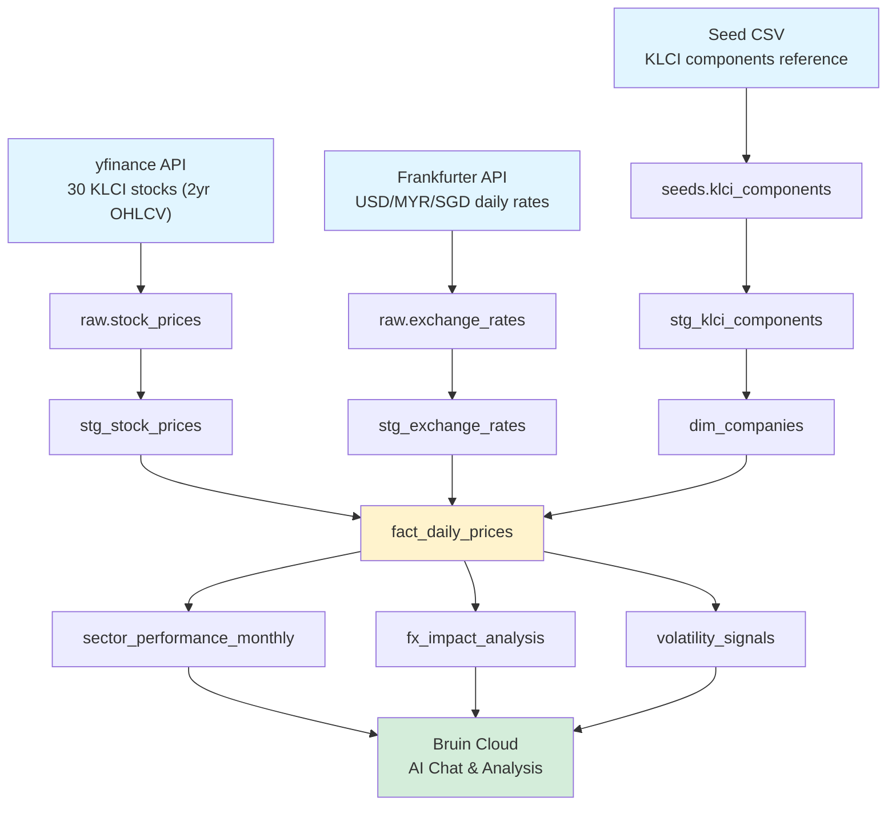
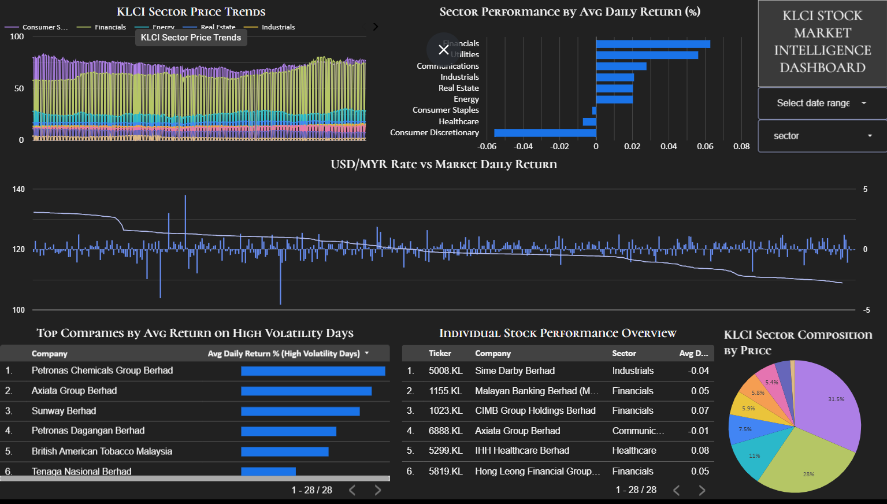
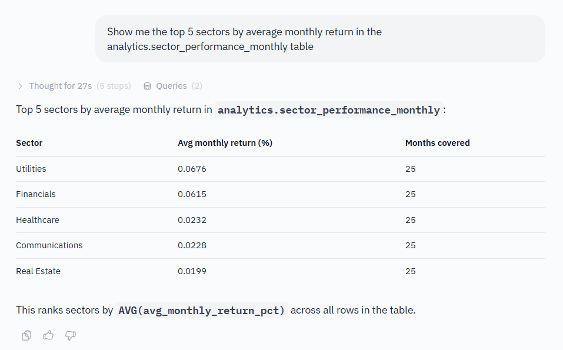
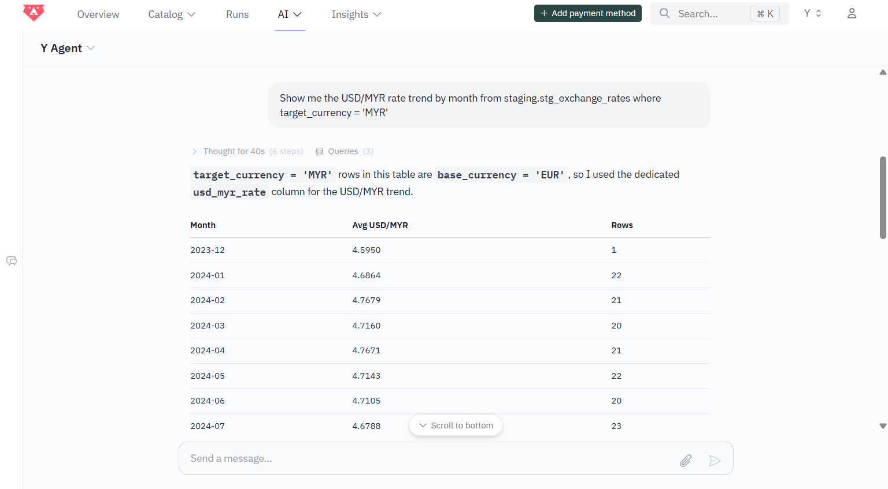
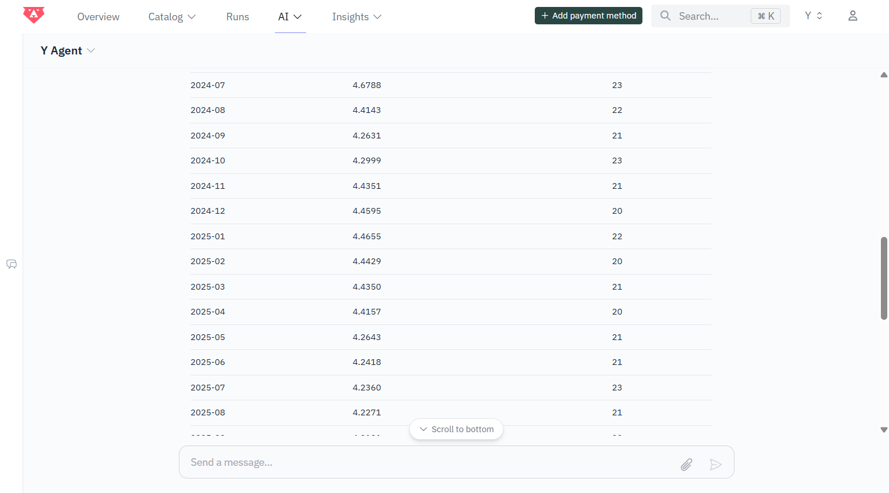
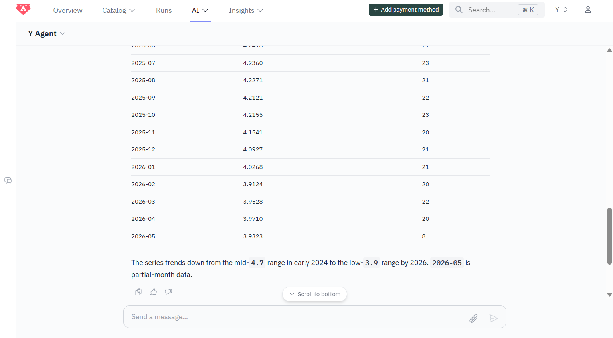
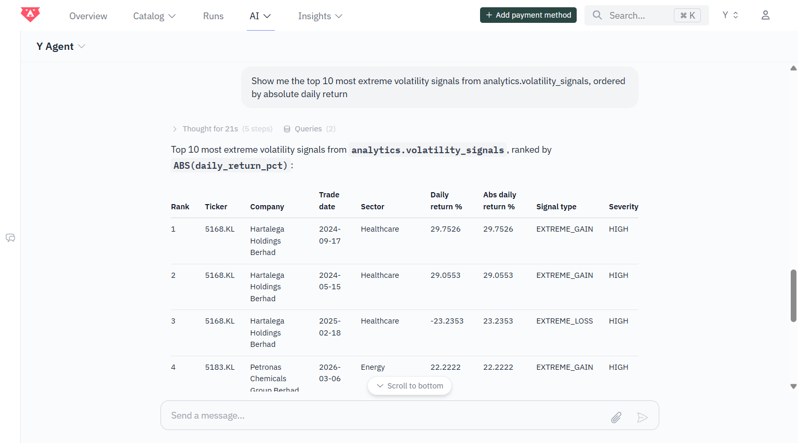
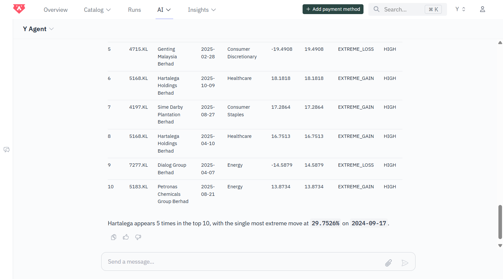

# Bursa Pulse
Malaysian investors and analysts lack a unified platform that correlates Bursa Malaysia stock performance with USD/MYR exchange rate movements. Heavy foreign institutional ownership in KLCI stocks means currency fluctuations directly drive capital flows, yet existing tools treat these dimensions separately.

The project is built for analysts and investors who need a reliable, automated view of how macroeconomic FX movements correlate with equity sector performance in Malaysia. It is built to answer one core question: **how does currency movement affect sector performance on Bursa Malaysia?**

Questions this pipeline answers:
- Which sectors are most sensitive to MYR movements against USD?
- When does FX volatility precede abnormal selling in Financials or Energy?
- Which stocks exhibit the highest volatility on high-impact market days?


## Architecture



**Four-layer design (Kimball star schema):**
- **Raw:** direct ingestion from APIs and seed files
- **Staging:** cleaning, type casting, derived columns (daily return %, intraday range)
- **Marts:** dimensional model with `fact_daily_prices` joined to `dim_companies`
- **Analytics:** pre-aggregated tables for dashboards and AI analysis


## Tech Stack

| Layer | Tool | Purpose |
|-------|------|---------|
| Ingestion | Bruin + Python | Pull from yfinance and Frankfurter API into BigQuery |
| Transformation | dbt (BigQuery adapter) | Staging models, dimensional modelling, data tests |
| Orchestration | Kestra | Daily pipeline scheduling, weekdays 6PM MYT |
| Infrastructure | Terraform | BigQuery dataset provisioning as code |
| Data Warehouse | Google BigQuery | Cloud storage and query engine |
| Visualization | Looker Studio | Interactive dashboard |
| CI/CD | GitHub Actions | Bruin pipeline validation on push |


## Data Sources

| Source | Type | Description | Cost |
|--------|------|-------------|------|
| Yahoo Finance via yfinance | Python library | Daily OHLCV for KLCI 30 component stocks | Free |
| Frankfurter API | REST API | EUR/USD/MYR/SGD exchange rates | Free, no key required |
| KLCI components | Seed CSV | Sector, subsector, market cap, Shariah compliance | Manual curation |


## Data Quality

Two layers of automated quality checks across the entire pipeline.

**Bruin quality checks (77 total)** across ingestion and transformation:

| Layer | Asset | Checks |
|-------|-------|--------|
| Raw | raw.stock_prices | 13 |
| Raw | raw.exchange_rates | 6 |
| Staging | stg_stock_prices | 13 |
| Staging | stg_exchange_rates | 5 |
| Staging | stg_klci_components | 8 |
| Marts | dim_companies | 6 |
| Marts | fact_daily_prices | 11 |
| Analytics | sector_performance_monthly | 3 |
| Analytics | fx_impact_analysis | 3 |
| Analytics | volatility_signals | 9 |

**dbt data tests (23 total)** across staging and mart models: `not_null`, `unique`, `accepted_values` on all critical columns.


## Dashboard

[Malaysia Market Intelligence Dashboard](#) ← replace with Looker Studio link



Charts included:
- KLCI Sector Price Trends
- USD/MYR Rate vs Market Daily Return (core insight)
- Sector Performance by Avg Daily Return
- Top Companies by Avg Return on High Volatility Days
- Individual Stock Performance Overview
- KLCI Sector Composition by Price

Interactive controls: date range selector, sector filter.


## Bruin Cloud AI Chat

Bruin Cloud's AI Chat enables natural language querying of the analytics layer, demonstrating AI-augmented analytics workflow.

Features used:
- **Python Assets** — custom ingestion from Yahoo Finance and Frankfurter API
- **Seed Assets** — static KLCI component reference table loaded from CSV
- **SQL Assets** — full staging and marts transformation layer
- **Quality Checks** — 77 automated checks across all layers
- **`bruin ai enhance`** — AI-powered column descriptions, domain tags, and data quality suggestions
- **`bruin lineage`** — full DAG visualisation of asset dependencies
- **`bruin validate`** — integrated into GitHub Actions CI/CD
- **Pipeline scheduling** — daily execution on weekdays post-market close
- **Bruin MCP** — natural language querying of pipeline data via Claude

### Sector Performance Ranking

> *"Show me the top 5 sectors by average monthly return"*



Utilities leads with avg monthly return of 0.068% (Tenaga Nasional), with Financials close second at 0.062% (Maybank, CIMB, Public Bank). Consumer Discretionary underperforms with negative average returns, reflecting sensitivity to domestic consumer sentiment and import cost pressures during MYR depreciation periods. Energy did not rank in top 5 despite the global oil narrative.

### USD/MYR Trend Analysis

> *"Show me the USD/MYR rate trend by month"*





MYR strengthened ~18% against USD from 4.78 (Jan 2024) to 3.93 (May 2026). The sharpest appreciation phase occurred Aug 2024 (4.41) to Sep 2024 (4.26). A stronger MYR pressures export-heavy sectors while benefiting import-reliant consumer sectors.

### Extreme Volatility Signals

> *"Show me the top 10 most extreme volatility signals"*




Hartalega Holdings appears 5 times in the top 10, with a max single-day gain of +29.75% (2024-09-17). Petronas Chemicals spiked +22.22% (2026-03-06) on an Energy sector event. Healthcare and Energy dominate the high-beta tail, relevant for portfolio risk management during macro events.


## Project Structure

| Folder | Contents |
|--------|----------|
| `bruin/` | Bruin pipeline: Python ingestion assets, SQL transformation assets, pipeline.yml |
| `dbt/bursa_pulse/models/staging/` | dbt staging models and source definitions |
| `dbt/bursa_pulse/models/marts/` | dbt dimensional models (dim_companies, fact_daily_prices) |
| `terraform/` | Terraform config for BigQuery dataset provisioning |
| `orchestration/` | Kestra flow YAML, docker-compose, cron fallback script |
| `images/` | Dashboard and AI analysis screenshots |


## How to Run

### Prerequisites

- Bruin CLI: `curl -LsSf https://getbruin.com/install/cli | sh`
- Python 3.11
- GCP account with BigQuery enabled
- Service account JSON with BigQuery Admin role
- Docker (for Kestra orchestration)

### Setup

```bash
# Clone the repo
git clone https://github.com/yiinyaan/bursa-pulse.git
cd bursa-pulse

# 1. Provision infrastructure
cd terraform
terraform init
terraform apply

# 2. Run Bruin ingestion pipeline
cd ../bruin
pip install yfinance pandas requests
bruin run .

# 3. Run dbt transformations
cd ../dbt/bursa_pulse
source ../../dbt-env/bin/activate
dbt run --profiles-dir ~/.dbt
dbt test --profiles-dir ~/.dbt

# 4. Start Kestra orchestration
cd ../../orchestration
docker compose up -d
# Import flow via http://localhost:8080
```


